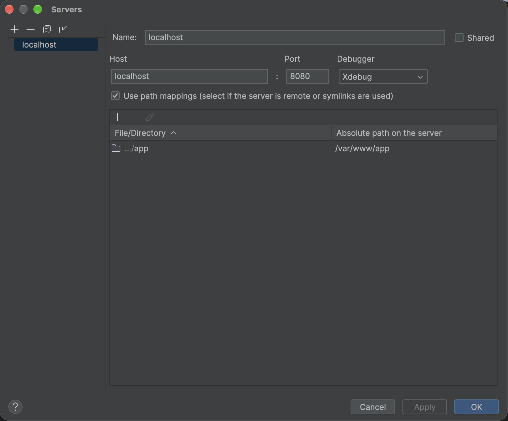
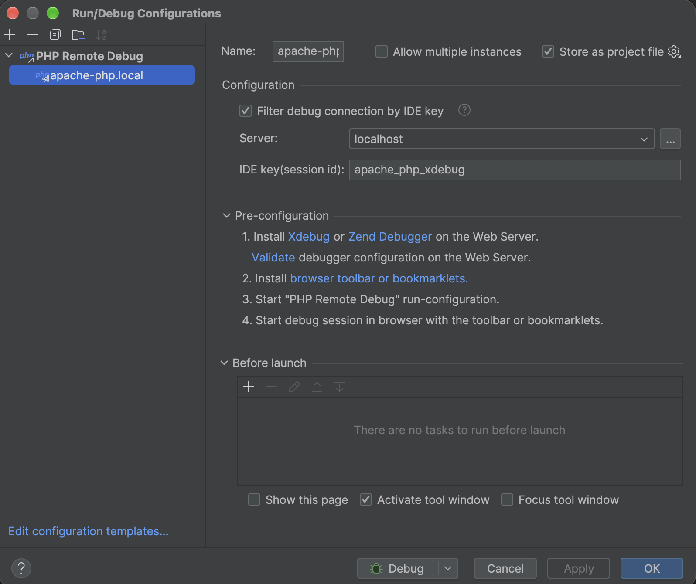

# Apache PHP (with XDebug) Docker Image

[](https://hub.docker.com/r/alaugks/apache-php/tags?ordering=name&name=8.2)

Based on `php:8.2.34-apache`.

## Table of Contents

- [PHP Modules](#php-modules)
- [Build](#build)
  - [Build without XDebug](#build-without-xdebug)
  - [Local Build Script](#local-build-script)
  - [Release (Docker Hub)](#release-docker-hub)
- [Docker Compose Example](#docker-compose-example)
  - [Production (without XDebug)](#production-without-xdebug)
  - [Development (with XDebug)](#development-with-xdebug)
- [Configuration](#configuration)
  - [Paths](#paths)
  - [Change the DocumentRoot or the vhost](#change-the-documentroot-or-the-vhost)
  - [Add Apache configuration](#add-apache-configuration)
  - [Change the PHP configuration](#change-the-php-configuration)
  - [XDebug](#xdebug)
  - [XDebug in IntelliJ IDEA / PhpStorm](#xdebug-in-intellij-idea--phpstorm)
- [Frontend](#frontend)
- [Docker Entrypoint](#docker-entrypoint)
- [PHPUnit](#phpunit)

## PHP Modules

Core, ctype, curl, date, dom, exif, fileinfo, filter, gd, hash, iconv, imagick, intl, json, libxml, mbstring, mysqli, mysqlnd, openssl, pcre, PDO, pdo_mysql, pdo_sqlite, Phar, posix, random, readline, redis, Reflection, session, SimpleXML, sodium, SPL, sqlite3, standard, tokenizer, xml, xmlreader, xmlwriter, zip, zlib

## Build

The `Dockerfile` is multi-stage with a shared `base` and two targets:

| Target | Description | Tag |
|---|---|---|
| `production` (default) | No XDebug | `<version>` |
| `xdebug` | `base` + XDebug 3 | `<version>-xdebug` |

```bash
docker build --target production -t alaugks/apache-php:local .
docker build --target xdebug -t alaugks/apache-php:local-xdebug .
```

### Build without XDebug

```bash
docker compose -f docker-compose.yml up -d --build
```

### Local Build Script

```bash
./build-local.sh
./build-local.sh --tag 8.2.34
./build-local.sh --tag 8.2.34 --with-xdebug
```

Run `./build-local.sh --help` for all options.

### Release (Docker Hub)

The GitHub Actions workflow `Push Image` (manual trigger, `workflow_dispatch`) builds and pushes both images in a single step using `docker buildx bake` and [`docker-bake.hcl`](docker-bake.hcl):

| Image | Target |
|---|---|
| `alaugks/apache-php:<ref>` | `production` |
| `alaugks/apache-php:<ref>-xdebug` | `xdebug` |

`<ref>` is the branch or tag the workflow is run on. Both targets are built for `linux/amd64` and `linux/arm64`.

`docker-bake.hcl` uses the GitHub Actions cache and is therefore meant for CI. Use `./build-local.sh` for local builds.

## Docker Compose Example

### Production (without XDebug)

```yaml
services:
  php:
    container_name: your_projekt
    image: alaugks/apache-php:8.2.34-v1.0
    volumes:
      - ./app:/var/www/app
    ports:
      - "8003:80"
    environment:
      APPLICATION_ENV: "production"
```

### Development (with XDebug)

```yaml
services:
  php:
    container_name: your_projekt_local
    image: alaugks/apache-php:8.2.34-v1.0-xdebug
    volumes:
      - ./app:/var/www/app
    ports:
      - "8003:80"
    environment:
      APPLICATION_ENV: "docker"
      PHP_IDE_CONFIG: "serverName=your_projekt_local"
      XDEBUG_CONFIG: "idekey=your_projekt"
```

## Configuration

### Paths

| What | Path in the container |
|---|---|
| Working directory (`WORKDIR`), mount your project here | `/var/www/app` |
| `DocumentRoot` | `/var/www/app/public` |
| `DirectoryIndex` | `index.php` |
| Apache vhost (from [`000-default.conf`](000-default.conf)) | `/etc/apache2/sites-available/000-default.conf` |
| Apache main config | `/etc/apache2/apache2.conf` |
| Apache enabled modules / confs | `/etc/apache2/mods-enabled/`, `/etc/apache2/conf-enabled/` |
| PHP ini scan dir (additional `*.ini` files) | `/usr/local/etc/php/conf.d/` |
| PHP ini directory (`PHP_INI_DIR`) | `/usr/local/etc/php/` |
| XDebug config (`xdebug` image only) | `/usr/local/etc/php/conf.d/xdebug.ini` |
| XDebug log (`xdebug` image only) | `/tmp/xdebug.log` |

Apache runs as `www-data`. Access and error logs are written to `stdout`/`stderr` (`docker logs <container>`).

The default vhost:

```apache
<VirtualHost *:80>
    DocumentRoot /var/www/app/public
    DirectoryIndex index.php
    ErrorLog /dev/stderr
    TransferLog /dev/stdout
</VirtualHost>
```

Enabled Apache module in addition to the base image defaults: `rewrite`.

### Change the DocumentRoot or the vhost

Mount your own vhost file over the default one:

```yaml
services:
  php:
    image: alaugks/apache-php:8.2.34
    volumes:
      - ./app:/var/www/app
      - ./my-vhost.conf:/etc/apache2/sites-available/000-default.conf:ro
```

```apache
<VirtualHost *:80>
    DocumentRoot /var/www/app/web
    DirectoryIndex index.php

    <Directory /var/www/app/web>
        AllowOverride All
        Require all granted
    </Directory>

    ErrorLog /dev/stderr
    TransferLog /dev/stdout
</VirtualHost>
```

### Add Apache configuration

Mount a file into `conf-enabled` to add global settings (applied in addition to the vhost):

```yaml
    volumes:
      - ./apache-custom.conf:/etc/apache2/conf-enabled/custom.conf:ro
```

```apache
ServerName localhost
ServerTokens Prod
```

Additional modules can be enabled in a derived image:

```dockerfile
FROM alaugks/apache-php:8.2.34
RUN a2enmod headers expires
```

### Change the PHP configuration

The image ships **no `php.ini`**, so PHP runs with its built-in defaults. Add settings as extra ini files in `/usr/local/etc/php/conf.d/`. Files are loaded in alphabetical order, so use a name that sorts after existing files (e.g. `zz-custom.ini`) to override earlier settings.

```yaml
    volumes:
      - ./php-custom.ini:/usr/local/etc/php/conf.d/zz-custom.ini:ro
```

```ini
memory_limit = 512M
upload_max_filesize = 64M
post_max_size = 64M
max_execution_time = 60
date.timezone = Europe/Berlin
```

To start from one of the templates shipped with PHP (`php.ini-production` or `php.ini-development`), use a derived image:

```dockerfile
FROM alaugks/apache-php:8.2.34
RUN cp "$PHP_INI_DIR/php.ini-production" "$PHP_INI_DIR/php.ini"
```

Settings can be checked with `docker exec <container> php -i | grep <setting>` or via phpinfo() (see [Frontend](#frontend)).

### XDebug

Only in the `-xdebug` image. The defaults in `xdebug.ini`:

```ini
xdebug.mode=debug,develop,coverage
xdebug.client_host=host.docker.internal
xdebug.start_with_request=yes
xdebug.log=/tmp/xdebug.log
```

Override single values with an additional ini file (e.g. `zz-xdebug.ini`) or with the `XDEBUG_CONFIG` environment variable (e.g. `idekey`, `client_port`). Use `PHP_IDE_CONFIG: "serverName=<name>"` to match the server name configured in your IDE.

After changing mounted configuration files, restart the container: `docker compose restart php`.

### XDebug in IntelliJ IDEA / PhpStorm

The values match [`docker-compose-xdebug.yml`](docker-compose-xdebug.yml) (`serverName=localhost`, `idekey=apache_php_xdebug`, port `8080`).

**1. Server** (*Settings > PHP > Servers*)



| Setting | Value |
|---|---|
| Name | `localhost` (must match `serverName` in `PHP_IDE_CONFIG`) |
| Host / Port | `localhost` / `8080` |
| Debugger | `Xdebug` |
| Use path mappings | enabled, project `app` directory → `/var/www/app` |

**2. Run/Debug configuration** (*Run > Edit Configurations > PHP Remote Debug*)



| Setting | Value |
|---|---|
| Filter debug connection by IDE key | enabled |
| Server | `localhost` |
| IDE key (session id) | `apache_php_xdebug` (must match `idekey` in `XDEBUG_CONFIG`) |

**3. Start debugging**

Start the run configuration (*Debug*), enable *Start Listening for PHP Debug Connections* and open http://localhost:8080 in the browser. `xdebug.start_with_request=yes` is already configured in the `-xdebug` image (see [XDebug](#xdebug)), so no browser extension or additional setup is needed.

## Frontend

Open phpinfo() with http://localhost:8080

## Docker Entrypoint

The entrypoint script sets ownership and default ACLs for `/var/www/app` to `www-data`.

## PHPUnit

```bash
vendor/bin/phpunit
```
